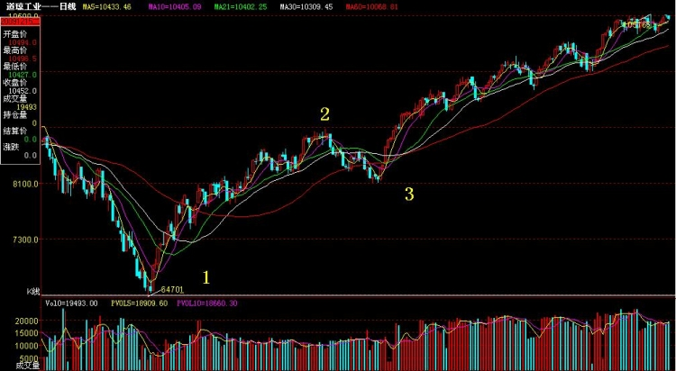
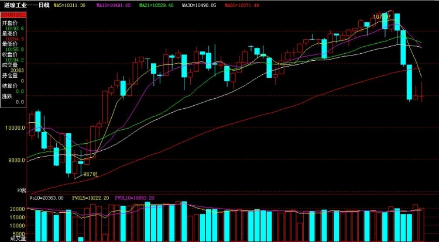
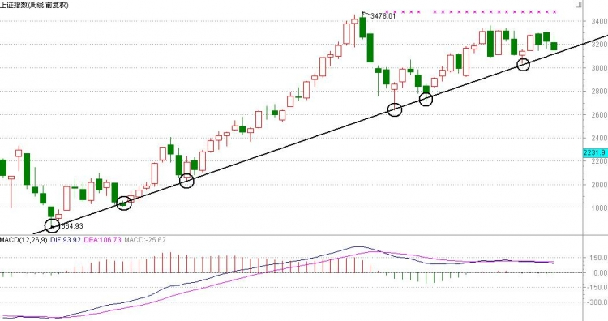
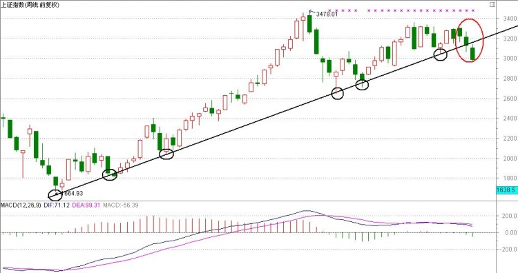
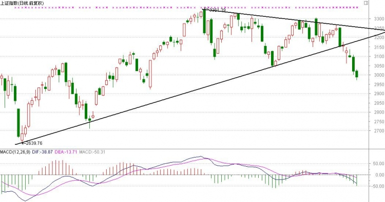
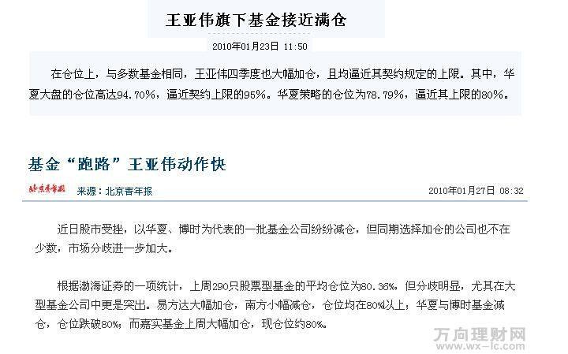
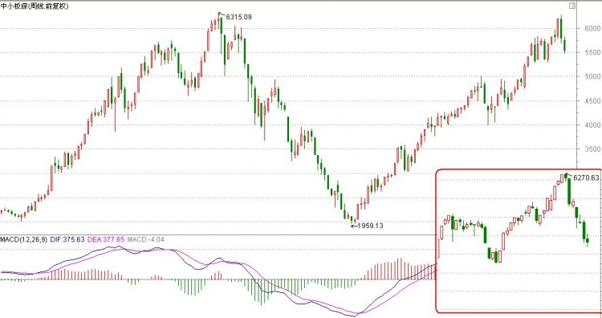
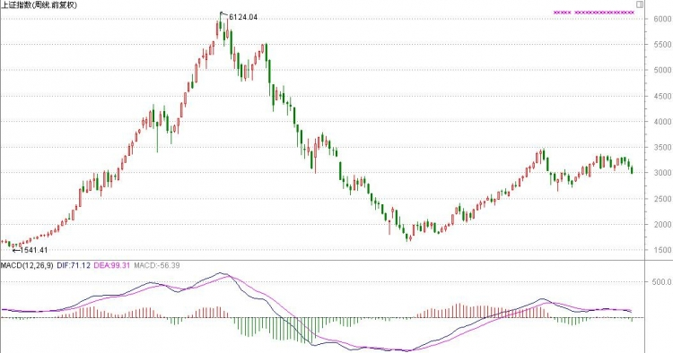
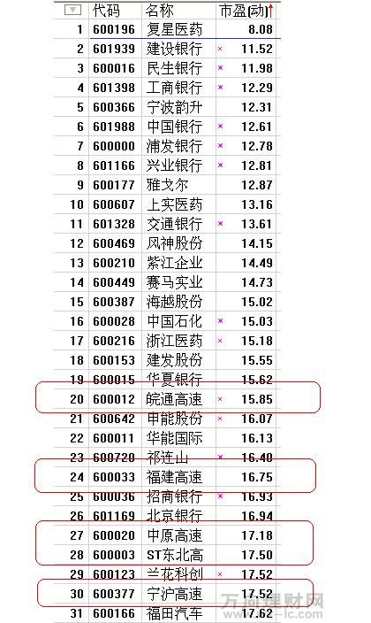
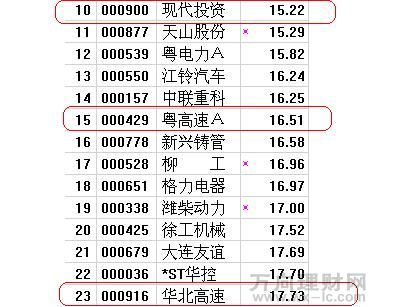

# 大盘分析｜大模型知识版

> 每张课件是一个独立知识单元。图片、录音位置、讲解语义、视觉语义和课程知识定位应作为同一数据块切分。

```yaml
course_id: xxm-2010-01-27-market
course_date: 2010-01-27
document_title: "大盘分析"
slide_count: 10
document_type: historical_market_analysis
knowledge_unit: one_slide_one_chunk
investment_advice: false
```

## 逐图知识单元

<!-- pagebreak -->

## MARKET-SLIDE-001｜道琼斯指数：空间、速度与结构综合判断



```yaml
unit_id: MARKET-SLIDE-001
source_slide: "大盘分析（0127）/1.jpg"
audio_part: "中"
audio_time: "00:36:03–00:37:31"
alignment_confidence: "明确"
knowledge_path: "大盘分析 → 第一部分“海外指数验证” → 空间、速度与结构的综合应用 → 当前知识点“道琼斯指数：空间、速度与结构综合判断”"
```

**讲解语义：** 老师回顾此前对道指的判断：用“123求4”得到约11080点空间目标；第二段上涨耗时更长、速度更慢，并在目标附近形成顶部结构，因此把该段视为“最后一升”。

**视觉语义：** 黑线标出1、2、3三个位置和右侧目标区，叠加均线与成交量。

**课程知识定位：** 大盘分析 → 第一部分“海外指数验证” → 空间、速度与结构的综合应用 → 当前知识点“道琼斯指数：空间、速度与结构综合判断”。这组图用道琼斯指数验证主课方法，展示空间目标、浪型速度和顶部结构如何共同形成判断。

**检索标题：** 大盘分析；大盘分析（0127）；道琼斯指数：空间、速度与结构综合判断；1.jpg

<!-- pagebreak -->

## MARKET-SLIDE-002｜道指短周期：缓涨后的快速下跌



```yaml
unit_id: MARKET-SLIDE-002
source_slide: "大盘分析（0127）/2.jpg"
audio_part: "中→下"
audio_time: "中00:37:31–结束；下00:00:00–00:00:42"
alignment_confidence: "明确"
knowledge_path: "大盘分析 → 第一部分“海外指数验证” → 空间、速度与结构的综合应用 → 当前知识点“道指短周期：缓涨后的快速下跌”"
```

**讲解语义：** 老师指出，顶部前连续多日缓慢上涨带来的利润，可能被随后三根快速阴线迅速吞没。图中三浪上涨的第三浪也明显慢于第一浪，因此不期待第五浪，应在第三浪末端防守。

**视觉语义：** 周K线右侧先缓升后连续大阴线下跌，体现速度反转。

**课程知识定位：** 大盘分析 → 第一部分“海外指数验证” → 空间、速度与结构的综合应用 → 当前知识点“道指短周期：缓涨后的快速下跌”。这组图用道琼斯指数验证主课方法，展示空间目标、浪型速度和顶部结构如何共同形成判断。

**检索标题：** 大盘分析；大盘分析（0127）；道指短周期：缓涨后的快速下跌；2.jpg

<!-- pagebreak -->

## MARKET-SLIDE-003｜上证周线：六个触点趋势线已经破位



```yaml
unit_id: MARKET-SLIDE-003
source_slide: "大盘分析（0127）/3.jpg"
audio_part: "下"
audio_time: "00:00:42–00:02:19"
alignment_confidence: "明确"
knowledge_path: "大盘分析 → 第二部分“A股趋势破位” → 周线与日线的执行 → 当前知识点“上证周线：六个触点趋势线已经破位”"
```

**讲解语义：** 老师指出，只有图中画法能连接约六个重要触点，符合“触点越多越有效”。最新高点距趋势线较近，破位所需能量较少，因此周线破位时应快速反应。

**视觉语义：** 上证周线自998点以来的上升趋势线连接多个圆圈低点。

**课程知识定位：** 大盘分析 → 第二部分“A股趋势破位” → 周线与日线的执行 → 当前知识点“上证周线：六个触点趋势线已经破位”。这组图把趋势线取点和远近规则用于2010年1月的上证指数，说明破位预案与实际执行。

**检索标题：** 大盘分析；大盘分析（0127）；上证周线：六个触点趋势线已经破位；3.jpg

<!-- pagebreak -->

## MARKET-SLIDE-004｜周线破位的实际发生位置



```yaml
unit_id: MARKET-SLIDE-004
source_slide: "大盘分析（0127）/4.jpg"
audio_part: "下"
audio_time: "00:02:19–00:03:09"
alignment_confidence: "明确"
knowledge_path: "大盘分析 → 第二部分“A股趋势破位” → 周线与日线的执行 → 当前知识点“周线破位的实际发生位置”"
```

**讲解语义：** 老师说明，红圈中的第二根阴线在盘中完成真正破位。即使尾盘可能拉回，也不能把执行建立在侥幸上；周线级别破位应按预案处理。

**视觉语义：** 在上一张周线基础上增加红色圆圈，突出实际破位K线。

**课程知识定位：** 大盘分析 → 第二部分“A股趋势破位” → 周线与日线的执行 → 当前知识点“周线破位的实际发生位置”。这组图把趋势线取点和远近规则用于2010年1月的上证指数，说明破位预案与实际执行。

**检索标题：** 大盘分析；大盘分析（0127）；周线破位的实际发生位置；4.jpg

<!-- pagebreak -->

## MARKET-SLIDE-005｜日线三角形向下突破与机会成本



```yaml
unit_id: MARKET-SLIDE-005
source_slide: "大盘分析（0127）/5.jpg"
audio_part: "下"
audio_time: "00:03:09–00:05:51"
alignment_confidence: "明确"
knowledge_path: "大盘分析 → 第二部分“A股趋势破位” → 周线与日线的执行 → 当前知识点“日线三角形向下突破与机会成本”"
```

**讲解语义：** 老师从日线补充：多个高点和低点形成三角形，最终选择向下突破。即使未来向上重新突破、需在更高位置买回，放弃约90点机会成本换取趋势确认，也优于承担更大下跌风险。

**视觉语义：** 上下两条收敛线构成三角形，右侧K线向下跌破并持续走弱。

**课程知识定位：** 大盘分析 → 第二部分“A股趋势破位” → 周线与日线的执行 → 当前知识点“日线三角形向下突破与机会成本”。这组图把趋势线取点和远近规则用于2010年1月的上证指数，说明破位预案与实际执行。

**检索标题：** 大盘分析；大盘分析（0127）；日线三角形向下突破与机会成本；5.jpg

<!-- pagebreak -->

## MARKET-SLIDE-006｜基金高仓位、赎回与被动卖出反馈



```yaml
unit_id: MARKET-SLIDE-006
source_slide: "大盘分析（0127）/6.jpg"
audio_part: "下"
audio_time: "00:05:51–00:15:50"
alignment_confidence: "明确"
knowledge_path: "大盘分析 → 第三部分“市场资金” → 基金仓位、赎回与被动卖出 → 当前知识点“基金高仓位、赎回与被动卖出反馈”"
```

**讲解语义：** 老师结合两篇当时报道讨论基金仓位：王亚伟管理基金接近仓位上限，其他基金也处在高位。市场下跌引发赎回时，基金为准备现金可能被迫卖股，形成“下跌—赎回—卖出—再下跌”的反馈。该部分属于2010年课堂观点。

**视觉语义：** 上半部分是王亚伟旗下基金接近满仓的报道，下半部分讨论基金“跑路”与市场分化。

**课程知识定位：** 大盘分析 → 第三部分“市场资金” → 基金仓位、赎回与被动卖出 → 当前知识点“基金高仓位、赎回与被动卖出反馈”。该图从资金供求解释下跌可能如何自我强化，是技术图形之外的市场流动性补充。

**检索标题：** 大盘分析；大盘分析（0127）；基金高仓位、赎回与被动卖出反馈；6.jpg

<!-- pagebreak -->

## MARKET-SLIDE-007｜中小板接近前高后的风险



```yaml
unit_id: MARKET-SLIDE-007
source_slide: "大盘分析（0127）/7.jpg"
audio_part: "下"
audio_time: "00:15:50–00:18:15"
alignment_confidence: "明确"
knowledge_path: "大盘分析 → 第四部分“市场风格” → 中小盘与大盘蓝筹的相对位置 → 当前知识点“中小板接近前高后的风险”"
```

**讲解语义：** 老师指出，中小板综合指数已从1959点反弹至接近6315点前高，右下角日线却出现快速下跌。他据此认为，经历2009年大幅上涨后，小盘股短期风险较高。

**视觉语义：** 主图为中小板周线完整牛熊周期，红框嵌入近期日线快速下跌。

**课程知识定位：** 大盘分析 → 第四部分“市场风格” → 中小盘与大盘蓝筹的相对位置 → 当前知识点“中小板接近前高后的风险”。这组图通过指数相对涨幅讨论大小盘风格轮动，把技术位置与资金偏好结合起来。

**检索标题：** 大盘分析；大盘分析（0127）；中小板接近前高后的风险；7.jpg

<!-- pagebreak -->

## MARKET-SLIDE-008｜上证指数与中小板的相对位置



```yaml
unit_id: MARKET-SLIDE-008
source_slide: "大盘分析（0127）/8.jpg"
audio_part: "下"
audio_time: "00:18:15–00:20:22"
alignment_confidence: "明确"
knowledge_path: "大盘分析 → 第四部分“市场风格” → 中小盘与大盘蓝筹的相对位置 → 当前知识点“上证指数与中小板的相对位置”"
```

**讲解语义：** 老师把上证指数与中小板对比：上证从6124点跌至1664点后，反弹至3478点仍未恢复前期跌幅的一半，明显落后于接近前高的中小板。他据此讨论资金可能由题材、小盘向大盘蓝筹轮动。

**视觉语义：** 上证周线展示6124—1664—3478的大周期位置，与上一张中小板形成对照。

**课程知识定位：** 大盘分析 → 第四部分“市场风格” → 中小盘与大盘蓝筹的相对位置 → 当前知识点“上证指数与中小板的相对位置”。这组图通过指数相对涨幅讨论大小盘风格轮动，把技术位置与资金偏好结合起来。

**检索标题：** 大盘分析；大盘分析（0127）；上证指数与中小板的相对位置；8.jpg

<!-- pagebreak -->

## MARKET-SLIDE-009｜沪市低市盈率排序与行业筛选



```yaml
unit_id: MARKET-SLIDE-009
source_slide: "大盘分析（0127）/9.jpg"
audio_part: "下"
audio_time: "00:20:22–00:25:52"
alignment_confidence: "明确"
knowledge_path: "大盘分析 → 第五部分“年报行情” → 低市盈率与高送转历史筛选 → 当前知识点“沪市低市盈率排序与行业筛选”"
```

**讲解语义：** 老师在年报行情背景下，用市盈率、每股收益、每股资本公积等指标寻找可能的高送转线索，并观察银行、医药、高速等行业集中情况。他明确这是当时的筛选思路，不等于确定送转，也不构成现时推荐。

**视觉语义：** 沪市股票按市盈率排序，红框标出皖通高速、福建高速等高速公路公司。

**课程知识定位：** 大盘分析 → 第五部分“年报行情” → 低市盈率与高送转历史筛选 → 当前知识点“沪市低市盈率排序与行业筛选”。这组图还原2010年课堂中的选股筛选思路，属于历史案例，不应直接迁移为当前投资建议。

**检索标题：** 大盘分析；大盘分析（0127）；沪市低市盈率排序与行业筛选；9.jpg

<!-- pagebreak -->

## MARKET-SLIDE-010｜深市低市盈率排序与历史候选



```yaml
unit_id: MARKET-SLIDE-010
source_slide: "大盘分析（0127）/10.jpg"
audio_part: "下"
audio_time: "00:25:52–00:29:49"
alignment_confidence: "明确"
knowledge_path: "大盘分析 → 第五部分“年报行情” → 低市盈率与高送转历史筛选 → 当前知识点“深市低市盈率排序与历史候选”"
```

**讲解语义：** 老师继续查看深市低市盈率名单，点出现代投资、粤高速、华北高速等，并结合未分配利润和资本公积讨论高送转可能性；同时强调当时整体策略仍偏向大盘蓝筹。名单仅用于还原2010年课堂语境。

**视觉语义：** 深市列表按市盈率排列，红框标出若干当时被关注的低估值或高速公路股票。

**课程知识定位：** 大盘分析 → 第五部分“年报行情” → 低市盈率与高送转历史筛选 → 当前知识点“深市低市盈率排序与历史候选”。这组图还原2010年课堂中的选股筛选思路，属于历史案例，不应直接迁移为当前投资建议。

**检索标题：** 大盘分析；大盘分析（0127）；深市低市盈率排序与历史候选；10.jpg

