# 结构和趋势｜大模型知识版

> 每张课件是一个独立知识单元。图片、录音位置、讲解语义、视觉语义和课程知识定位应作为同一数据块切分。

```yaml
course_id: xxm-2010-01-27-structure-trend
course_date: 2010-01-27
document_title: "结构和趋势"
slide_count: 43
document_type: main_course
knowledge_unit: one_slide_one_chunk
investment_advice: false
```

## 逐图知识单元

<!-- pagebreak -->

## MAIN-SLIDE-001｜结构的两种研究方式


```yaml
unit_id: MAIN-SLIDE-001
source_slide: "结构（上）/1.jpg"
audio_part: "上"
audio_time: "00:05:01–00:05:57"
alignment_confidence: "明确"
knowledge_path: "主课“结构和趋势” → 第一部分“结构” → 1.1 浪型结构 → 当前知识点“结构的两种研究方式”"
```

**讲解语义：** 老师把结构分为浪型结构和背离结构：浪型结构研究行情运行的过程，背离结构研究顶部或底部等转折结果。

**视觉语义：** 标题页列出两条主线，是本节结构课程的总目录。

**课程知识定位：** 主课“结构和趋势” → 第一部分“结构” → 1.1 浪型结构 → 当前知识点“结构的两种研究方式”。这是结构课程的起点，用速度判断行情止于三浪还是继续延伸，为后面的背离识别与级别判断建立基础。

**检索标题：** 结构和趋势；结构（上）；结构的两种研究方式；1.jpg

<!-- pagebreak -->

## MAIN-SLIDE-002｜市场波动由基本浪型构成

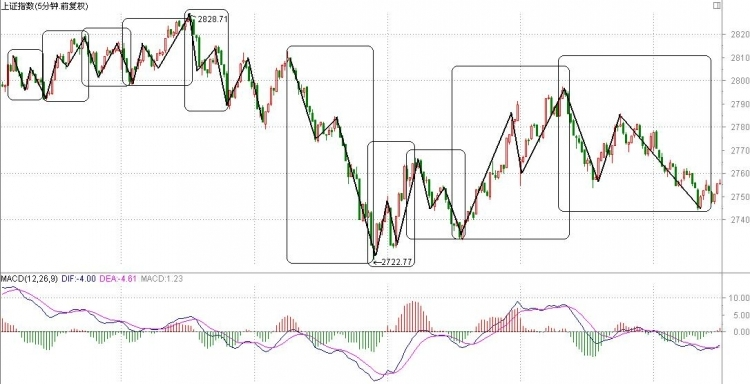

```yaml
unit_id: MAIN-SLIDE-002
source_slide: "结构（上）/2.jpg"
audio_part: "上"
audio_time: "00:05:57–00:06:44"
alignment_confidence: "明确"
knowledge_path: "主课“结构和趋势” → 第一部分“结构” → 1.1 浪型结构 → 当前知识点“市场波动由基本浪型构成”"
```

**讲解语义：** 老师以分时走势说明，只要市场存在波动，就会出现浪型；最小、最常见的单元是N字形三浪转向，五浪可看作三浪的延伸组合。

**视觉语义：** 图中的多个方框圈出不同尺度的N字波动，说明相似结构会在不同位置和周期重复出现。

**课程知识定位：** 主课“结构和趋势” → 第一部分“结构” → 1.1 浪型结构 → 当前知识点“市场波动由基本浪型构成”。这是结构课程的起点，用速度判断行情止于三浪还是继续延伸，为后面的背离识别与级别判断建立基础。

**检索标题：** 结构和趋势；结构（上）；市场波动由基本浪型构成；2.jpg

<!-- pagebreak -->

## MAIN-SLIDE-003｜用第三浪速度判断三浪或五浪

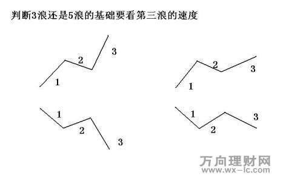

```yaml
unit_id: MAIN-SLIDE-003
source_slide: "结构（上）/3.jpg"
audio_part: "上"
audio_time: "00:06:44–00:09:32"
alignment_confidence: "明确"
knowledge_path: "主课“结构和趋势” → 第一部分“结构” → 1.1 浪型结构 → 当前知识点“用第三浪速度判断三浪或五浪”"
```

**讲解语义：** 老师提出基础判断：把第三浪与第一浪的速度作比较。第三浪更快，行情往往尚未结束，后面更容易出现第五浪；第三浪更慢，则第三浪本身更可能成为阶段终点。

**视觉语义：** 四个示意图覆盖上涨与下跌两种方向，以及第三浪快于或慢于第一浪的组合。

**课程知识定位：** 主课“结构和趋势” → 第一部分“结构” → 1.1 浪型结构 → 当前知识点“用第三浪速度判断三浪或五浪”。这是结构课程的起点，用速度判断行情止于三浪还是继续延伸，为后面的背离识别与级别判断建立基础。

**检索标题：** 结构和趋势；结构（上）；用第三浪速度判断三浪或五浪；3.jpg

<!-- pagebreak -->

## MAIN-SLIDE-004｜第三浪更快：倾向仍有第五浪

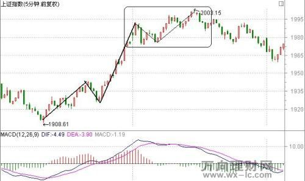

```yaml
unit_id: MAIN-SLIDE-004
source_slide: "结构（上）/4.jpg"
audio_part: "上"
audio_time: "00:09:32–00:13:00"
alignment_confidence: "明确"
knowledge_path: "主课“结构和趋势” → 第一部分“结构” → 1.1 浪型结构 → 当前知识点“第三浪更快：倾向仍有第五浪”"
```

**讲解语义：** 老师指出，图中第三段上升明显快于第一段，因此第三浪结束处不宜直接认定为整段上涨终点，后面仍有形成第五浪的较大概率。

**视觉语义：** 黑线标出两段上涨；第二段斜率更陡，方框圈出第三浪后的整理区域。

**课程知识定位：** 主课“结构和趋势” → 第一部分“结构” → 1.1 浪型结构 → 当前知识点“第三浪更快：倾向仍有第五浪”。这是结构课程的起点，用速度判断行情止于三浪还是继续延伸，为后面的背离识别与级别判断建立基础。

**检索标题：** 结构和趋势；结构（上）；第三浪更快：倾向仍有第五浪；4.jpg

<!-- pagebreak -->

## MAIN-SLIDE-005｜第三浪减速：可能止于三浪

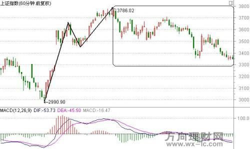

```yaml
unit_id: MAIN-SLIDE-005
source_slide: "结构（上）/5.jpg"
audio_part: "上"
audio_time: "00:13:00–00:14:30"
alignment_confidence: "明确"
knowledge_path: "主课“结构和趋势” → 第一部分“结构” → 1.1 浪型结构 → 当前知识点“第三浪减速：可能止于三浪”"
```

**讲解语义：** 老师把这一例与上一例对照：第三浪上升速度明显减弱，后续未必还有第五浪，因此在第三浪末端就应提高减仓和防守意识。

**视觉语义：** 第一段上升陡峭，后续上升趋缓；方框标出高位整理和转弱过程。

**课程知识定位：** 主课“结构和趋势” → 第一部分“结构” → 1.1 浪型结构 → 当前知识点“第三浪减速：可能止于三浪”。这是结构课程的起点，用速度判断行情止于三浪还是继续延伸，为后面的背离识别与级别判断建立基础。

**检索标题：** 结构和趋势；结构（上）；第三浪减速：可能止于三浪；5.jpg

<!-- pagebreak -->

## MAIN-SLIDE-006｜快速第三浪下跌后的延续风险

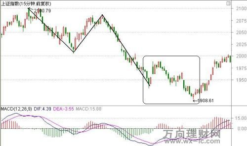

```yaml
unit_id: MAIN-SLIDE-006
source_slide: "结构（上）/6.jpg"
audio_part: "上"
audio_time: "00:14:30–00:16:34"
alignment_confidence: "明确"
knowledge_path: "主课“结构和趋势” → 第一部分“结构” → 1.1 浪型结构 → 当前知识点“快速第三浪下跌后的延续风险”"
```

**讲解语义：** 老师说明，第三浪下跌快于第一浪时，方框中的反弹不能轻易当作调整结束。结合当日快速下跌，他提醒在下跌周期中应等待更大级别结构，不宜因一次小反弹贸然买入。

**视觉语义：** 黑线勾勒三浪下跌，末端方框显示反弹与再次探底，体现快速下跌后的延续性。

**课程知识定位：** 主课“结构和趋势” → 第一部分“结构” → 1.1 浪型结构 → 当前知识点“快速第三浪下跌后的延续风险”。这是结构课程的起点，用速度判断行情止于三浪还是继续延伸，为后面的背离识别与级别判断建立基础。

**检索标题：** 结构和趋势；结构（上）；快速第三浪下跌后的延续风险；6.jpg

<!-- pagebreak -->

## MAIN-SLIDE-007｜第三浪下跌减速：转势概率提高

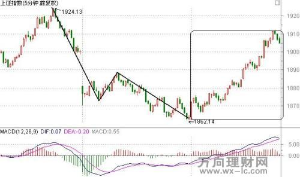

```yaml
unit_id: MAIN-SLIDE-007
source_slide: "结构（上）/7.jpg"
audio_part: "上"
audio_time: "00:16:34–00:21:06"
alignment_confidence: "明确"
knowledge_path: "主课“结构和趋势” → 第一部分“结构” → 1.1 浪型结构 → 当前知识点“第三浪下跌减速：转势概率提高”"
```

**讲解语义：** 老师指出，第三浪下跌明显慢于第一浪时，能量已经衰减，转势概率上升。该方法在分时周期尤其常用，但仍应结合结构确认。

**视觉语义：** 从1924附近到1862附近的下跌分成两段，后段速度趋缓，随后出现较强反弹。

**课程知识定位：** 主课“结构和趋势” → 第一部分“结构” → 1.1 浪型结构 → 当前知识点“第三浪下跌减速：转势概率提高”。这是结构课程的起点，用速度判断行情止于三浪还是继续延伸，为后面的背离识别与级别判断建立基础。

**检索标题：** 结构和趋势；结构（上）；第三浪下跌减速：转势概率提高；7.jpg

<!-- pagebreak -->

## MAIN-SLIDE-008｜延伸浪：速度尚未衰竭

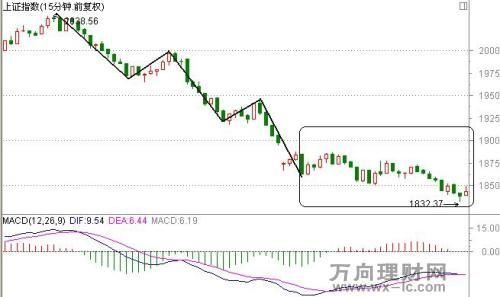

```yaml
unit_id: MAIN-SLIDE-008
source_slide: "结构（上）/8.jpg"
audio_part: "上"
audio_time: "00:21:06–00:21:56"
alignment_confidence: "明确"
knowledge_path: "主课“结构和趋势” → 第一部分“结构” → 1.1 浪型结构 → 当前知识点“延伸浪：速度尚未衰竭”"
```

**讲解语义：** 老师解释，如果第五浪仍快于第三浪，说明下跌能量尚未衰竭，行情可能继续延伸，直到后续一浪的速度被调平。七浪等延伸形态虽不常见，但可以用速度识别。

**视觉语义：** 图中连续下跌后进入方框整理并再次创新低，示意下跌浪的延伸过程。

**课程知识定位：** 主课“结构和趋势” → 第一部分“结构” → 1.1 浪型结构 → 当前知识点“延伸浪：速度尚未衰竭”。这是结构课程的起点，用速度判断行情止于三浪还是继续延伸，为后面的背离识别与级别判断建立基础。

**检索标题：** 结构和趋势；结构（上）；延伸浪：速度尚未衰竭；8.jpg

<!-- pagebreak -->

## MAIN-SLIDE-009｜上涨延伸浪与指标同步创新高

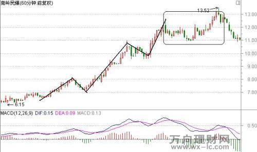

```yaml
unit_id: MAIN-SLIDE-009
source_slide: "结构（上）/9.jpg"
audio_part: "上"
audio_time: "00:21:56–00:24:24"
alignment_confidence: "明确"
knowledge_path: "主课“结构和趋势” → 第一部分“结构” → 1.1 浪型结构 → 当前知识点“上涨延伸浪与指标同步创新高”"
```

**讲解语义：** 老师把延伸浪反向应用于上涨：在最后高点形成前，价格和趋势指标通常仍同步抬高；若指标还能创新高，就不能仅凭上涨次数认定顶部背离。

**视觉语义：** 股价由6.15附近多段上升至13.52附近，MACD高点随行情上移，体现延伸阶段。

**课程知识定位：** 主课“结构和趋势” → 第一部分“结构” → 1.1 浪型结构 → 当前知识点“上涨延伸浪与指标同步创新高”。这是结构课程的起点，用速度判断行情止于三浪还是继续延伸，为后面的背离识别与级别判断建立基础。

**检索标题：** 结构和趋势；结构（上）；上涨延伸浪与指标同步创新高；9.jpg

<!-- pagebreak -->

## MAIN-SLIDE-010｜速度相仿时结合大周期方向

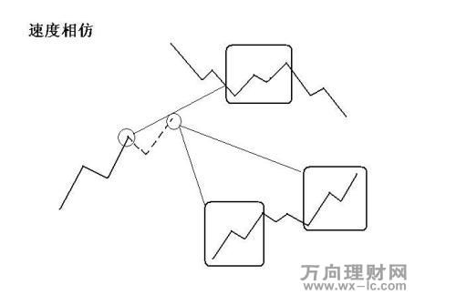

```yaml
unit_id: MAIN-SLIDE-010
source_slide: "结构（中）/11.jpg"
audio_part: "上"
audio_time: "00:24:24–00:27:11"
alignment_confidence: "明确"
knowledge_path: "主课“结构和趋势” → 第一部分“结构” → 1.2 浪型结构的周期应用 → 当前知识点“速度相仿时结合大周期方向”"
```

**讲解语义：** 老师说明，当第一浪与第三浪速度差异不明显时，应由大周期方向决定交易偏好：下降大周期中的反弹倾向在三浪高点卖出；上升大周期中的顺向上升可适当等待第五浪。

**视觉语义：** 示意图在一条下降路径上圈出多个小级别波动，强调小周期结构必须放回大周期理解。

**课程知识定位：** 主课“结构和趋势” → 第一部分“结构” → 1.2 浪型结构的周期应用 → 当前知识点“速度相仿时结合大周期方向”。这一层把单个浪型放回大周期方向，说明小周期三浪或五浪的处理必须服从更大的趋势背景。

**检索标题：** 结构和趋势；结构（中）；速度相仿时结合大周期方向；11.jpg

<!-- pagebreak -->

## MAIN-SLIDE-011｜顶部背离的定义

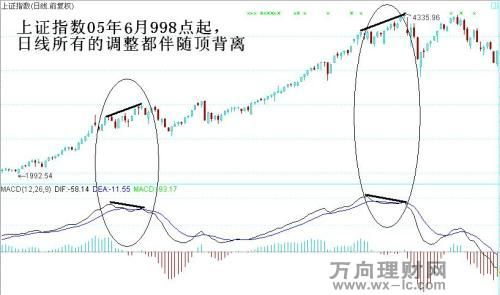

```yaml
unit_id: MAIN-SLIDE-011
source_slide: "结构（中）/12.jpg"
audio_part: "上"
audio_time: "00:27:11–00:28:22"
alignment_confidence: "明确"
knowledge_path: "主课“结构和趋势” → 第一部分“结构” → 1.3 背离结构的定义与确认 → 当前知识点“顶部背离的定义”"
```

**讲解语义：** 老师定义顶部背离：价格高点继续上移，而MACD的DIF高点下降。判断时价格与指标都连接高点，并优先使用日线或周线寻找大级别顶部。

**视觉语义：** 图中价格两处顶部抬高，而下方DIF峰值降低，椭圆标出两个比较区间。

**课程知识定位：** 主课“结构和趋势” → 第一部分“结构” → 1.3 背离结构的定义与确认 → 当前知识点“顶部背离的定义”。这是从研究行情过程转向识别顶部和底部的核心定义，重点区分钝化、极值转向和背离确认。

**检索标题：** 结构和趋势；结构（中）；顶部背离的定义；12.jpg

<!-- pagebreak -->

## MAIN-SLIDE-012｜底部背离的定义

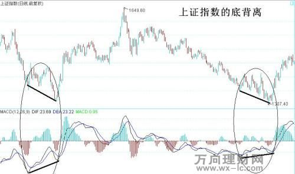

```yaml
unit_id: MAIN-SLIDE-012
source_slide: "结构（中）/13.jpg"
audio_part: "上"
audio_time: "00:28:22–00:29:38"
alignment_confidence: "明确"
knowledge_path: "主课“结构和趋势” → 第一部分“结构” → 1.3 背离结构的定义与确认 → 当前知识点“底部背离的定义”"
```

**讲解语义：** 老师定义底部背离：价格低点创新低，而DIF低点不再创新低、反而上移。价格先出现钝化，待指标极值转向后，背离结构才得到确认。

**视觉语义：** 两个椭圆中价格低点下移，而指标低点抬高，构成典型底背离。

**课程知识定位：** 主课“结构和趋势” → 第一部分“结构” → 1.3 背离结构的定义与确认 → 当前知识点“底部背离的定义”。这是从研究行情过程转向识别顶部和底部的核心定义，重点区分钝化、极值转向和背离确认。

**检索标题：** 结构和趋势；结构（中）；底部背离的定义；13.jpg

<!-- pagebreak -->

## MAIN-SLIDE-013｜同一行情中的多次背离与钝化

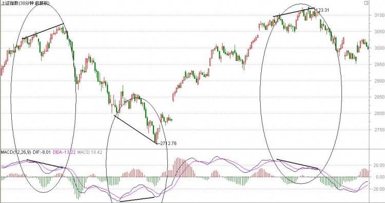

```yaml
unit_id: MAIN-SLIDE-013
source_slide: "结构（中）/13-1.jpg"
audio_part: "上"
audio_time: "00:29:38–00:33:16"
alignment_confidence: "明确"
knowledge_path: "主课“结构和趋势” → 第一部分“结构” → 1.3 背离结构的定义与确认 → 当前知识点“同一行情中的多次背离与钝化”"
```

**讲解语义：** 老师结合当时30分钟行情指出，上升高点、下跌低点都伴随结构。价格创新高或新低但DIF拒绝同步时称为钝化；极值转向后才确认背离，可据速度决定是否提前逆向。

**视觉语义：** 图中多个椭圆分别圈出顶部和底部区域，展示背离在一段行情中可反复出现。

**课程知识定位：** 主课“结构和趋势” → 第一部分“结构” → 1.3 背离结构的定义与确认 → 当前知识点“同一行情中的多次背离与钝化”。这是从研究行情过程转向识别顶部和底部的核心定义，重点区分钝化、极值转向和背离确认。

**检索标题：** 结构和趋势；结构（中）；同一行情中的多次背离与钝化；13-1.jpg

<!-- pagebreak -->

## MAIN-SLIDE-014｜顶部背离级别：上涨越缓，结构越强

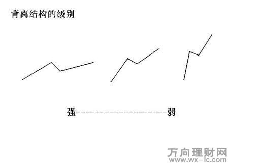

```yaml
unit_id: MAIN-SLIDE-014
source_slide: "结构（中）/14.jpg"
audio_part: "上"
audio_time: "00:33:16–00:35:47"
alignment_confidence: "明确"
knowledge_path: "主课“结构和趋势” → 第一部分“结构” → 1.4 用价格速度判断背离级别 → 当前知识点“顶部背离级别：上涨越缓，结构越强”"
```

**讲解语义：** 老师强调，看结构强弱时先看价格速度。缓慢上涨形成的顶部背离惯性小、转势级别通常更大；快速上涨即使背离，也可能只是小级别并继续形成双重或多重背离。

**视觉语义：** 三种上涨折线从左到右由缓到急，图下注明背离强度由强到弱。

**课程知识定位：** 主课“结构和趋势” → 第一部分“结构” → 1.4 用价格速度判断背离级别 → 当前知识点“顶部背离级别：上涨越缓，结构越强”。这一层解决“同样出现背离，为什么重要性不同”，用上涨或下跌速度判断结构强弱。

**检索标题：** 结构和趋势；结构（中）；顶部背离级别：上涨越缓，结构越强；14.jpg

<!-- pagebreak -->

## MAIN-SLIDE-015｜底部背离级别：下跌越缓，结构越强

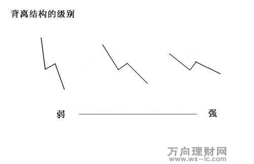

```yaml
unit_id: MAIN-SLIDE-015
source_slide: "结构（中）/15.jpg"
audio_part: "上"
audio_time: "00:35:47–00:37:30"
alignment_confidence: "明确"
knowledge_path: "主课“结构和趋势” → 第一部分“结构” → 1.4 用价格速度判断背离级别 → 当前知识点“底部背离级别：下跌越缓，结构越强”"
```

**讲解语义：** 老师将上一规则反向应用于下跌：快速下跌形成的底部结构较小；缓慢下跌已处于速度末期，若再与背离共振，反弹通常更快、更强。

**视觉语义：** 三种下跌折线从左到右由急到缓，底背离强度由弱到强。

**课程知识定位：** 主课“结构和趋势” → 第一部分“结构” → 1.4 用价格速度判断背离级别 → 当前知识点“底部背离级别：下跌越缓，结构越强”。这一层解决“同样出现背离，为什么重要性不同”，用上涨或下跌速度判断结构强弱。

**检索标题：** 结构和趋势；结构（中）；底部背离级别：下跌越缓，结构越强；15.jpg

<!-- pagebreak -->

## MAIN-SLIDE-016｜两个底背离的速度对比

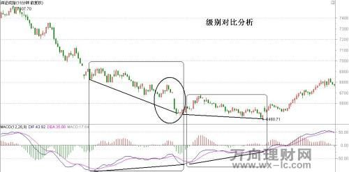

```yaml
unit_id: MAIN-SLIDE-016
source_slide: "结构（中）/16.jpg"
audio_part: "上"
audio_time: "00:37:30–00:38:22"
alignment_confidence: "明确"
knowledge_path: "主课“结构和趋势” → 第一部分“结构” → 1.4 用价格速度判断背离级别 → 当前知识点“两个底背离的速度对比”"
```

**讲解语义：** 老师比较两个方框：前一处虽然价格创新低、指标未创新低，但下跌仍快，结构偏小；后一处整体下跌已经很弱，形成的底背离级别更大，后续上涨也更充分。

**视觉语义：** 两个方框及中间圆圈把同一大趋势中的不同底背离并列展示。

**课程知识定位：** 主课“结构和趋势” → 第一部分“结构” → 1.4 用价格速度判断背离级别 → 当前知识点“两个底背离的速度对比”。这一层解决“同样出现背离，为什么重要性不同”，用上涨或下跌速度判断结构强弱。

**检索标题：** 结构和趋势；结构（中）；两个底背离的速度对比；16.jpg

<!-- pagebreak -->

## MAIN-SLIDE-017｜同为底背离，优先选择后一个慢速低点

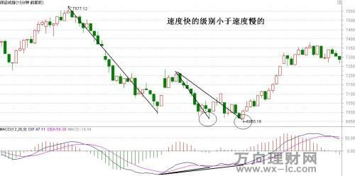

```yaml
unit_id: MAIN-SLIDE-017
source_slide: "结构（中）/17.jpg"
audio_part: "上"
audio_time: "00:38:22–00:39:26"
alignment_confidence: "明确"
knowledge_path: "主课“结构和趋势” → 第一部分“结构” → 1.4 用价格速度判断背离级别 → 当前知识点“同为底背离，优先选择后一个慢速低点”"
```

**讲解语义：** 老师指出两个圆圈都是可观察的底背离，但若只能选一个，应优先后一个，因为从反弹高点到后一个低点的速度更慢，能量衰竭更充分。

**视觉语义：** 两段下跌斜率不同，后段明显更缓；下方DIF同时形成抬高。

**课程知识定位：** 主课“结构和趋势” → 第一部分“结构” → 1.4 用价格速度判断背离级别 → 当前知识点“同为底背离，优先选择后一个慢速低点”。这一层解决“同样出现背离，为什么重要性不同”，用上涨或下跌速度判断结构强弱。

**检索标题：** 结构和趋势；结构（中）；同为底背离，优先选择后一个慢速低点；17.jpg

<!-- pagebreak -->

## MAIN-SLIDE-018｜同为顶背离，慢速上涨的级别更大

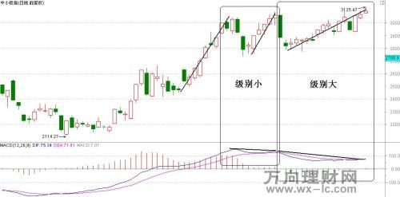

```yaml
unit_id: MAIN-SLIDE-018
source_slide: "结构（中）/18.jpg"
audio_part: "上"
audio_time: "00:39:26–00:40:05"
alignment_confidence: "明确"
knowledge_path: "主课“结构和趋势” → 第一部分“结构” → 1.4 用价格速度判断背离级别 → 当前知识点“同为顶背离，慢速上涨的级别更大”"
```

**讲解语义：** 老师把前例反向应用于上涨：第一次快速上升形成的顶背离偏小，第二次上涨放缓后再形成顶背离，结构级别更大，应更重视反向风险。

**视觉语义：** 两个方框分别标注“级别小”和“级别大”，对应两段不同速度的上涨。

**课程知识定位：** 主课“结构和趋势” → 第一部分“结构” → 1.4 用价格速度判断背离级别 → 当前知识点“同为顶背离，慢速上涨的级别更大”。这一层解决“同样出现背离，为什么重要性不同”，用上涨或下跌速度判断结构强弱。

**检索标题：** 结构和趋势；结构（中）；同为顶背离，慢速上涨的级别更大；18.jpg

<!-- pagebreak -->

## MAIN-SLIDE-019｜用时间跨度判断背离级别

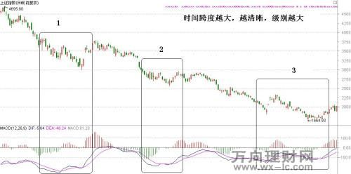

```yaml
unit_id: MAIN-SLIDE-019
source_slide: "结构（下）/19.jpg"
audio_part: "上"
audio_time: "00:40:05–00:42:00"
alignment_confidence: "明确"
knowledge_path: "主课“结构和趋势” → 第一部分“结构” → 1.5 用时间跨度判断背离级别 → 当前知识点“用时间跨度判断背离级别”"
```

**讲解语义：** 老师提出第二个级别标准：比较构成背离的两个高点或低点之间包含多少根K线。时间跨度越长，结构越清晰，通常级别越大。

**视觉语义：** 三个方框覆盖不同长度的下跌阶段，直接呈现“时间跨度越大，级别越大”。

**课程知识定位：** 主课“结构和趋势” → 第一部分“结构” → 1.5 用时间跨度判断背离级别 → 当前知识点“用时间跨度判断背离级别”。这一层在速度之外加入时间维度；比较点之间的K线越多，结构通常越清晰、级别越大。

**检索标题：** 结构和趋势；结构（下）；用时间跨度判断背离级别；19.jpg

<!-- pagebreak -->

## MAIN-SLIDE-020｜同周期中短跨度与长跨度背离

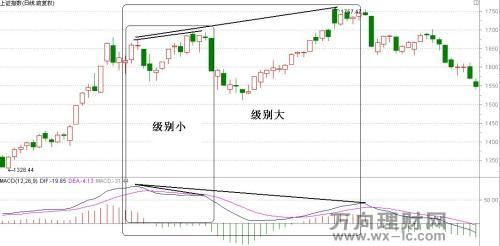

```yaml
unit_id: MAIN-SLIDE-020
source_slide: "结构（下）/20.jpg"
audio_part: "上"
audio_time: "00:42:00–00:43:37"
alignment_confidence: "明确"
knowledge_path: "主课“结构和趋势” → 第一部分“结构” → 1.5 用时间跨度判断背离级别 → 当前知识点“同周期中短跨度与长跨度背离”"
```

**讲解语义：** 老师以上证指数60分钟线说明：黑圈内两个低点间K线很少，只引发小级别反弹；后一个更长区间消耗的时间更多，形成更大级别的底背离。

**视觉语义：** 上下两组标线比较价格高低点与DIF峰谷，竖线标出不同时间跨度。

**课程知识定位：** 主课“结构和趋势” → 第一部分“结构” → 1.5 用时间跨度判断背离级别 → 当前知识点“同周期中短跨度与长跨度背离”。这一层在速度之外加入时间维度；比较点之间的K线越多，结构通常越清晰、级别越大。

**检索标题：** 结构和趋势；结构（下）；同周期中短跨度与长跨度背离；20.jpg

<!-- pagebreak -->

## MAIN-SLIDE-021｜当时行情中的时间跨度比较

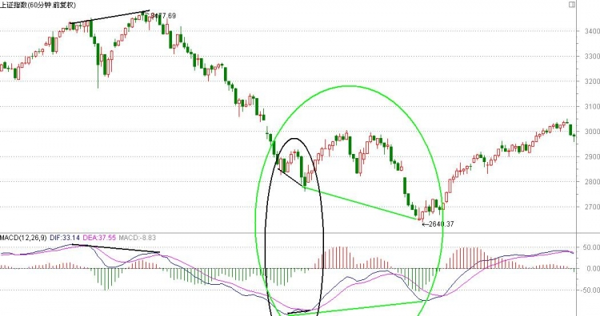

```yaml
unit_id: MAIN-SLIDE-021
source_slide: "结构（下）/20-1.jpg"
audio_part: "上"
audio_time: "00:43:37–00:44:13"
alignment_confidence: "推定对应"
knowledge_path: "主课“结构和趋势” → 第一部分“结构” → 1.5 用时间跨度判断背离级别 → 当前知识点“当时行情中的时间跨度比较”"
```

**讲解语义：** 老师继续用当时走势说明：前一次背离的两个比较点距离较近，级别较小；较大区域覆盖更多K线，时间跨度扩大后，结构的重要性也提高。

**视觉语义：** 绿色椭圆圈出较长的下跌和筑底区域，用于与前面的短跨度结构对照。

**课程知识定位：** 主课“结构和趋势” → 第一部分“结构” → 1.5 用时间跨度判断背离级别 → 当前知识点“当时行情中的时间跨度比较”。这一层在速度之外加入时间维度；比较点之间的K线越多，结构通常越清晰、级别越大。

**检索标题：** 结构和趋势；结构（下）；当时行情中的时间跨度比较；20-1.jpg

<!-- pagebreak -->

## MAIN-SLIDE-022｜第一浪固定时，第三浪越缓，底背离越强

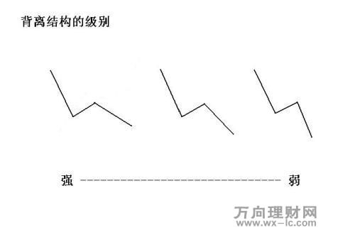

```yaml
unit_id: MAIN-SLIDE-022
source_slide: "结构（下）/21.jpg"
audio_part: "上→中"
audio_time: "上00:44:13–结束；中00:00:00–00:00:55"
alignment_confidence: "明确"
knowledge_path: "主课“结构和趋势” → 第一部分“结构” → 1.6 用第一浪与第三浪速度判断背离强弱 → 当前知识点“第一浪固定时，第三浪越缓，底背离越强”"
```

**讲解语义：** 老师说明，除整体速度外，还可以固定第一浪，再比较第三浪。第三浪下跌越缓，底背离越强；第三浪若仍很急，即便指标形成背离，往往也只是小级别。

**视觉语义：** 三种向下三浪结构从左到右由强到底背离较弱，图下注明强弱方向。

**课程知识定位：** 主课“结构和趋势” → 第一部分“结构” → 1.6 用第一浪与第三浪速度判断背离强弱 → 当前知识点“第一浪固定时，第三浪越缓，底背离越强”。这是结构部分的综合级别判断，把第一浪固定后比较第三浪速度，并用于筛选更可靠的顶部或底部。

**检索标题：** 结构和趋势；结构（下）；第一浪固定时，第三浪越缓，底背离越强；21.jpg

<!-- pagebreak -->

## MAIN-SLIDE-023｜第一浪固定时，第三浪越缓，顶背离越强

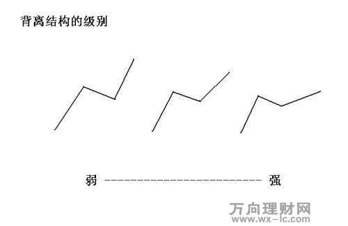

```yaml
unit_id: MAIN-SLIDE-023
source_slide: "结构（下）/22.jpg"
audio_part: "中"
audio_time: "00:00:55–00:01:12"
alignment_confidence: "明确"
knowledge_path: "主课“结构和趋势” → 第一部分“结构” → 1.6 用第一浪与第三浪速度判断背离强弱 → 当前知识点“第一浪固定时，第三浪越缓，顶背离越强”"
```

**讲解语义：** 老师把规则反向应用于上涨：第一浪固定后，第三浪越快，顶背离越弱；第三浪越慢，顶背离越强。

**视觉语义：** 三种上涨结构按第三浪速度排列，图下注明由弱到强。

**课程知识定位：** 主课“结构和趋势” → 第一部分“结构” → 1.6 用第一浪与第三浪速度判断背离强弱 → 当前知识点“第一浪固定时，第三浪越缓，顶背离越强”。这是结构部分的综合级别判断，把第一浪固定后比较第三浪速度，并用于筛选更可靠的顶部或底部。

**检索标题：** 结构和趋势；结构（下）；第一浪固定时，第三浪越缓，顶背离越强；22.jpg

<!-- pagebreak -->

## MAIN-SLIDE-024｜第三浪略慢：顶部背离强度有限

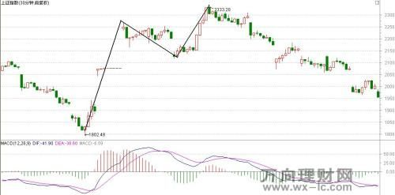

```yaml
unit_id: MAIN-SLIDE-024
source_slide: "结构（下）/23.jpg"
audio_part: "中"
audio_time: "00:01:12–00:01:47"
alignment_confidence: "明确"
knowledge_path: "主课“结构和趋势” → 第一部分“结构” → 1.6 用第一浪与第三浪速度判断背离强弱 → 当前知识点“第三浪略慢：顶部背离强度有限”"
```

**讲解语义：** 老师指出，这一例第三浪上升虽弱于第一浪，但角度和速度差距不大，因此形成的顶部背离强度相对有限。

**视觉语义：** 黑线标出两个上涨段，第二段只比第一段略缓。

**课程知识定位：** 主课“结构和趋势” → 第一部分“结构” → 1.6 用第一浪与第三浪速度判断背离强弱 → 当前知识点“第三浪略慢：顶部背离强度有限”。这是结构部分的综合级别判断，把第一浪固定后比较第三浪速度，并用于筛选更可靠的顶部或底部。

**检索标题：** 结构和趋势；结构（下）；第三浪略慢：顶部背离强度有限；23.jpg

<!-- pagebreak -->

## MAIN-SLIDE-025｜第三浪明显减速：顶部背离更强

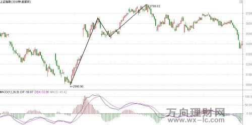

```yaml
unit_id: MAIN-SLIDE-025
source_slide: "结构（下）/24.jpg"
audio_part: "中"
audio_time: "00:01:47–00:02:18"
alignment_confidence: "明确"
knowledge_path: "主课“结构和趋势” → 第一部分“结构” → 1.6 用第一浪与第三浪速度判断背离强弱 → 当前知识点“第三浪明显减速：顶部背离更强”"
```

**讲解语义：** 老师将其与上一图对比：第三浪远弱于第一浪，因此属于更大的顶部背离。若用于比较卖点，应更重视这一类速度差异显著的品种。

**视觉语义：** 第一段上涨陡峭，第二段明显平缓，速度差异直观。

**课程知识定位：** 主课“结构和趋势” → 第一部分“结构” → 1.6 用第一浪与第三浪速度判断背离强弱 → 当前知识点“第三浪明显减速：顶部背离更强”。这是结构部分的综合级别判断，把第一浪固定后比较第三浪速度，并用于筛选更可靠的顶部或底部。

**检索标题：** 结构和趋势；结构（下）；第三浪明显减速：顶部背离更强；24.jpg

<!-- pagebreak -->

## MAIN-SLIDE-026｜不同尺度浪型共同决定结构强弱

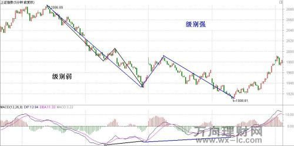

```yaml
unit_id: MAIN-SLIDE-026
source_slide: "结构（下）/25.jpg"
audio_part: "中"
audio_time: "00:02:18–00:03:35"
alignment_confidence: "明确"
knowledge_path: "主课“结构和趋势” → 第一部分“结构” → 1.6 用第一浪与第三浪速度判断背离强弱 → 当前知识点“不同尺度浪型共同决定结构强弱”"
```

**讲解语义：** 老师用黑线与蓝线拆分大小两组下跌浪，说明局部第三浪仍快时只形成小结构；更大尺度下跌逐渐放缓、指标抬高后，才构成更值得重视的底背离。

**视觉语义：** 图上同时画出大、小三浪，价格与DIF的比较体现多尺度结构嵌套。

**课程知识定位：** 主课“结构和趋势” → 第一部分“结构” → 1.6 用第一浪与第三浪速度判断背离强弱 → 当前知识点“不同尺度浪型共同决定结构强弱”。这是结构部分的综合级别判断，把第一浪固定后比较第三浪速度，并用于筛选更可靠的顶部或底部。

**检索标题：** 结构和趋势；结构（下）；不同尺度浪型共同决定结构强弱；25.jpg

<!-- pagebreak -->

## MAIN-SLIDE-027｜上升趋势线连接多个重要低点

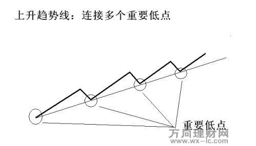

```yaml
unit_id: MAIN-SLIDE-027
source_slide: "趋势（上）/1.jpg"
audio_part: "中"
audio_time: "00:09:00–00:10:09"
alignment_confidence: "明确"
knowledge_path: "主课“结构和趋势” → 第二部分“趋势” → 2.1 趋势线的定义与方向 → 当前知识点“上升趋势线连接多个重要低点”"
```

**讲解语义：** 老师规定，上升趋势线连接多个重要低点，不连接高点。绝大多数K线应运行在线上方，向下破线意味着原上升趋势被终结。

**视觉语义：** 圆圈标出多个回调低点，直线将这些低点连接为上升趋势线。

**课程知识定位：** 主课“结构和趋势” → 第二部分“趋势” → 2.1 趋势线的定义与方向 → 当前知识点“上升趋势线连接多个重要低点”。这是趋势部分的基础规则，明确上升趋势连接低点、下降趋势连接高点，以及突破或破位的基本含义。

**检索标题：** 结构和趋势；趋势（上）；上升趋势线连接多个重要低点；1.jpg

<!-- pagebreak -->

## MAIN-SLIDE-028｜下降趋势线连接多个重要高点

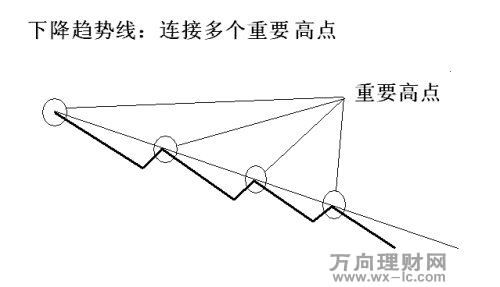

```yaml
unit_id: MAIN-SLIDE-028
source_slide: "趋势（上）/2.jpg"
audio_part: "中"
audio_time: "00:10:09–00:10:50"
alignment_confidence: "明确"
knowledge_path: "主课“结构和趋势” → 第二部分“趋势” → 2.1 趋势线的定义与方向 → 当前知识点“下降趋势线连接多个重要高点”"
```

**讲解语义：** 老师规定，下降趋势线连接多个阶段性重要高点。这里的“重要”指一段行情中具有代表性的峰值，而不是每根K线的最高价。

**视觉语义：** 圆圈标出多个反弹高点，下降直线形成上方压力线。

**课程知识定位：** 主课“结构和趋势” → 第二部分“趋势” → 2.1 趋势线的定义与方向 → 当前知识点“下降趋势线连接多个重要高点”。这是趋势部分的基础规则，明确上升趋势连接低点、下降趋势连接高点，以及突破或破位的基本含义。

**检索标题：** 结构和趋势；趋势（上）；下降趋势线连接多个重要高点；2.jpg

<!-- pagebreak -->

## MAIN-SLIDE-029｜大周期趋势线过滤重大错误

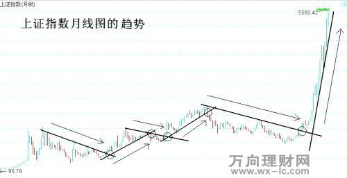

```yaml
unit_id: MAIN-SLIDE-029
source_slide: "趋势（上）/3.jpg"
audio_part: "中"
audio_time: "00:10:50–00:11:21"
alignment_confidence: "明确"
knowledge_path: "主课“结构和趋势” → 第二部分“趋势” → 2.1 趋势线的定义与方向 → 当前知识点“大周期趋势线过滤重大错误”"
```

**讲解语义：** 老师以上证指数月线说明，即使小错误无法完全避免，依据大周期趋势线进行买卖，也能较好规避大的踏空和大的下跌。

**视觉语义：** 多条月线趋势线与突破点展示长期趋势的反复建立和终结。

**课程知识定位：** 主课“结构和趋势” → 第二部分“趋势” → 2.1 趋势线的定义与方向 → 当前知识点“大周期趋势线过滤重大错误”。这是趋势部分的基础规则，明确上升趋势连接低点、下降趋势连接高点，以及突破或破位的基本含义。

**检索标题：** 结构和趋势；趋势（上）；大周期趋势线过滤重大错误；3.jpg

<!-- pagebreak -->

## MAIN-SLIDE-030｜上升趋势破位应及时卖出

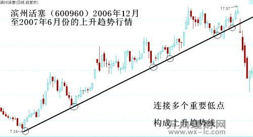

```yaml
unit_id: MAIN-SLIDE-030
source_slide: "趋势（上）/4.jpg"
audio_part: "中"
audio_time: "00:11:21–00:12:21"
alignment_confidence: "明确"
knowledge_path: "主课“结构和趋势” → 第二部分“趋势” → 2.1 趋势线的定义与方向 → 当前知识点“上升趋势破位应及时卖出”"
```

**讲解语义：** 老师以个股上升趋势说明，多低点连线一旦向下破位，意味着趋势结束，应及时卖出。卖出是为了保留未来更好的买入能力。

**视觉语义：** 股价多次回踩上升趋势线，右侧大阴线最终跌破。

**课程知识定位：** 主课“结构和趋势” → 第二部分“趋势” → 2.1 趋势线的定义与方向 → 当前知识点“上升趋势破位应及时卖出”。这是趋势部分的基础规则，明确上升趋势连接低点、下降趋势连接高点，以及突破或破位的基本含义。

**检索标题：** 结构和趋势；趋势（上）；上升趋势破位应及时卖出；4.jpg

<!-- pagebreak -->

## MAIN-SLIDE-031｜下降趋势突破构成买入条件

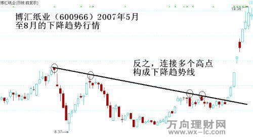

```yaml
unit_id: MAIN-SLIDE-031
source_slide: "趋势（上）/5.jpg"
audio_part: "中"
audio_time: "00:12:21–00:12:47"
alignment_confidence: "明确"
knowledge_path: "主课“结构和趋势” → 第二部分“趋势” → 2.1 趋势线的定义与方向 → 当前知识点“下降趋势突破构成买入条件”"
```

**讲解语义：** 老师把规则反向应用：多个重要高点连成下降趋势线，价格向上突破后，原下降趋势终结，可作为买入信号。

**视觉语义：** 下降压力线连接多个圆圈高点，右侧大阳线向上突破。

**课程知识定位：** 主课“结构和趋势” → 第二部分“趋势” → 2.1 趋势线的定义与方向 → 当前知识点“下降趋势突破构成买入条件”。这是趋势部分的基础规则，明确上升趋势连接低点、下降趋势连接高点，以及突破或破位的基本含义。

**检索标题：** 结构和趋势；趋势（上）；下降趋势突破构成买入条件；5.jpg

<!-- pagebreak -->

## MAIN-SLIDE-032｜触点越多，趋势线越有效

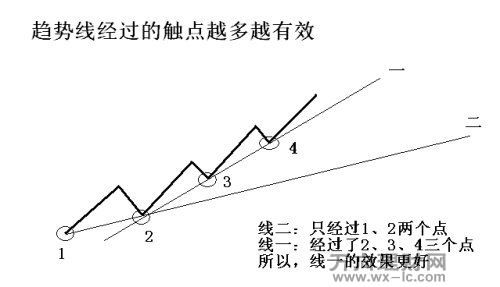

```yaml
unit_id: MAIN-SLIDE-032
source_slide: "趋势（上）/6.jpg"
audio_part: "中"
audio_time: "00:12:47–00:15:19"
alignment_confidence: "明确"
knowledge_path: "主课“结构和趋势” → 第二部分“趋势” → 2.2 趋势线取点的优先级 → 当前知识点“触点越多，趋势线越有效”"
```

**讲解语义：** 老师提出画线的优先级：如果多个低点不能落在同一条线上，应优先选择经过更多重要触点的趋势线。三点线通常比两点线更可靠。

**视觉语义：** 线一经过1、2、3、4多个点，线二只经过较少点，图中直接比较两条候选线。

**课程知识定位：** 主课“结构和趋势” → 第二部分“趋势” → 2.2 趋势线取点的优先级 → 当前知识点“触点越多，趋势线越有效”。这一层解决多条候选趋势线如何选择：先比较触点数量，数量相同时再选择距离当前更近的触点。

**检索标题：** 结构和趋势；趋势（上）；触点越多，趋势线越有效；6.jpg

<!-- pagebreak -->

## MAIN-SLIDE-033｜错误取线会造成巨大操作差异

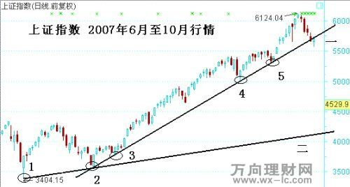

```yaml
unit_id: MAIN-SLIDE-033
source_slide: "趋势（上）/7.jpg"
audio_part: "中"
audio_time: "00:15:19–00:16:18"
alignment_confidence: "明确"
knowledge_path: "主课“结构和趋势” → 第二部分“趋势” → 2.2 趋势线取点的优先级 → 当前知识点“错误取线会造成巨大操作差异”"
```

**讲解语义：** 老师以上证指数2007年上涨为例：只连最早两个低点会把破位位置拖到约4000点，而连接更多触点的线可在约5700点附近识别破位，差异接近2000点。

**视觉语义：** 编号1至5标出多个低点，两条候选趋势线对应完全不同的破位位置。

**课程知识定位：** 主课“结构和趋势” → 第二部分“趋势” → 2.2 趋势线取点的优先级 → 当前知识点“错误取线会造成巨大操作差异”。这一层解决多条候选趋势线如何选择：先比较触点数量，数量相同时再选择距离当前更近的触点。

**检索标题：** 结构和趋势；趋势（上）；错误取线会造成巨大操作差异；7.jpg

<!-- pagebreak -->

## MAIN-SLIDE-034｜触点数量相同时，越接近当前越有效

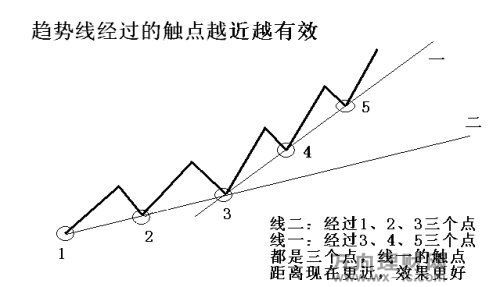

```yaml
unit_id: MAIN-SLIDE-034
source_slide: "趋势（上）/8.jpg"
audio_part: "中"
audio_time: "00:16:18–00:17:32"
alignment_confidence: "明确"
knowledge_path: "主课“结构和趋势” → 第二部分“趋势” → 2.2 趋势线取点的优先级 → 当前知识点“触点数量相同时，越接近当前越有效”"
```

**讲解语义：** 老师提出第二层优先级：如果候选趋势线经过的触点数量相同，应选择离当前行情更近的点，因为近期价格对当前市场的约束更强。

**视觉语义：** 线一经过较新的3、4、5点，线二经过较早的1、2、3点。

**课程知识定位：** 主课“结构和趋势” → 第二部分“趋势” → 2.2 趋势线取点的优先级 → 当前知识点“触点数量相同时，越接近当前越有效”。这一层解决多条候选趋势线如何选择：先比较触点数量，数量相同时再选择距离当前更近的触点。

**检索标题：** 结构和趋势；趋势（上）；触点数量相同时，越接近当前越有效；8.jpg

<!-- pagebreak -->

## MAIN-SLIDE-035｜实际走势中的近期触点原则

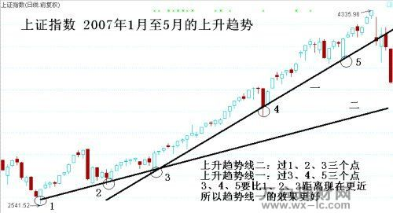

```yaml
unit_id: MAIN-SLIDE-035
source_slide: "趋势（上）/9.jpg"
audio_part: "中"
audio_time: "00:17:32–00:18:50"
alignment_confidence: "明确"
knowledge_path: "主课“结构和趋势” → 第二部分“趋势” → 2.2 趋势线取点的优先级 → 当前知识点“实际走势中的近期触点原则”"
```

**讲解语义：** 老师用实际指数走势图再次说明，连接3、4、5这些较近触点的趋势线，比连接1、2、3的旧趋势线更适合判断当前行情。

**视觉语义：** 图上两条上升趋势线分别连接不同编号低点，右侧破位位置明显不同。

**课程知识定位：** 主课“结构和趋势” → 第二部分“趋势” → 2.2 趋势线取点的优先级 → 当前知识点“实际走势中的近期触点原则”。这一层解决多条候选趋势线如何选择：先比较触点数量，数量相同时再选择距离当前更近的触点。

**检索标题：** 结构和趋势；趋势（上）；实际走势中的近期触点原则；9.jpg

<!-- pagebreak -->

## MAIN-SLIDE-036｜上升趋势：最近高点距线近，破位立即操作

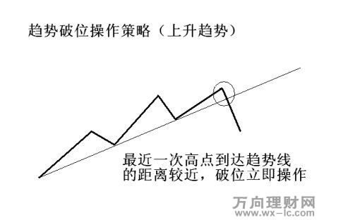

```yaml
unit_id: MAIN-SLIDE-036
source_slide: "趋势（上）/10.jpg"
audio_part: "中"
audio_time: "00:18:50–00:19:10"
alignment_confidence: "明确"
knowledge_path: "主课“结构和趋势” → 第二部分“趋势” → 2.3 破位与突破后的操作策略 → 当前知识点“上升趋势：最近高点距线近，破位立即操作”"
```

**讲解语义：** 老师给出操作规则：若最近一次高点距离上升趋势线很近，价格破位不需要消耗太多做空能量，破位后可能快速下跌，应立即执行卖出。

**视觉语义：** 圆圈中的高点紧邻趋势线，随后折线直接向下穿越。

**课程知识定位：** 主课“结构和趋势” → 第二部分“趋势” → 2.3 破位与突破后的操作策略 → 当前知识点“上升趋势：最近高点距线近，破位立即操作”。这是趋势知识转化为交易行动的部分；最近高低点距趋势线近则立即执行，距离远则考虑反抽或回踩。

**检索标题：** 结构和趋势；趋势（上）；上升趋势：最近高点距线近，破位立即操作；10.jpg

<!-- pagebreak -->

## MAIN-SLIDE-037｜下降趋势：最近低点距线近，突破立即操作

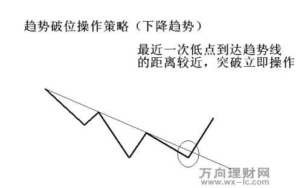

```yaml
unit_id: MAIN-SLIDE-037
source_slide: "趋势（下）/11.jpg"
audio_part: "中"
audio_time: "00:19:10–00:19:54"
alignment_confidence: "明确"
knowledge_path: "主课“结构和趋势” → 第二部分“趋势” → 2.3 破位与突破后的操作策略 → 当前知识点“下降趋势：最近低点距线近，突破立即操作”"
```

**讲解语义：** 老师将前一规则反向应用：若最近低点距下降趋势线很近，向上突破后应快速执行买入，不宜等待。

**视觉语义：** 圆圈中的低点靠近下降趋势线，之后价格向上突破。

**课程知识定位：** 主课“结构和趋势” → 第二部分“趋势” → 2.3 破位与突破后的操作策略 → 当前知识点“下降趋势：最近低点距线近，突破立即操作”。这是趋势知识转化为交易行动的部分；最近高低点距趋势线近则立即执行，距离远则考虑反抽或回踩。

**检索标题：** 结构和趋势；趋势（下）；下降趋势：最近低点距线近，突破立即操作；11.jpg

<!-- pagebreak -->

## MAIN-SLIDE-038｜近距离破位的历史实例

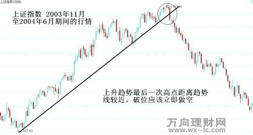

```yaml
unit_id: MAIN-SLIDE-038
source_slide: "趋势（下）/12.jpg"
audio_part: "中"
audio_time: "00:19:54–00:21:28"
alignment_confidence: "明确"
knowledge_path: "主课“结构和趋势” → 第二部分“趋势” → 2.3 破位与突破后的操作策略 → 当前知识点“近距离破位的历史实例”"
```

**讲解语义：** 老师以上证指数2003年11月至2004年6月走势说明，最后一个高点靠近上升趋势线，破位时应立即卖出；若拖延，行情可能一去不回。

**视觉语义：** 长上升趋势线连接多个低点，顶部圆圈标出距线很近的最后高点及随后破位。

**课程知识定位：** 主课“结构和趋势” → 第二部分“趋势” → 2.3 破位与突破后的操作策略 → 当前知识点“近距离破位的历史实例”。这是趋势知识转化为交易行动的部分；最近高低点距趋势线近则立即执行，距离远则考虑反抽或回踩。

**检索标题：** 结构和趋势；趋势（下）；近距离破位的历史实例；12.jpg

<!-- pagebreak -->

## MAIN-SLIDE-039｜2010年当时行情的预案图

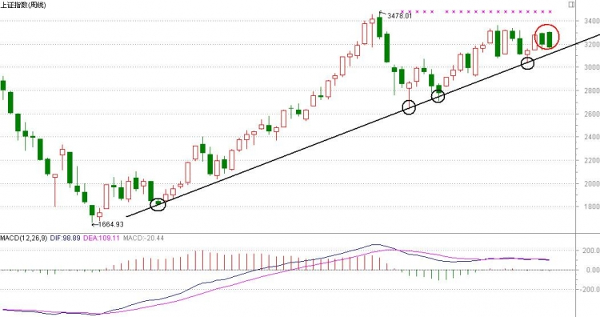

```yaml
unit_id: MAIN-SLIDE-039
source_slide: "趋势（下）/12-1.jpg"
audio_part: "中"
audio_time: "00:21:28–00:23:39"
alignment_confidence: "明确"
knowledge_path: "主课“结构和趋势” → 第二部分“趋势” → 2.3 破位与突破后的操作策略 → 当前知识点“2010年当时行情的预案图”"
```

**讲解语义：** 老师强调这是一张课前反复讲过的预案图：3478点离趋势线较远，第一次下跌可能止跌；而当时最近高点已经贴近趋势线，一旦破位，就不能寄望必有反抽，应提前决定如何执行。

**视觉语义：** 上证指数周线连接多个重要低点，右侧绿色圆圈标出临近趋势线的最新K线。

**课程知识定位：** 主课“结构和趋势” → 第二部分“趋势” → 2.3 破位与突破后的操作策略 → 当前知识点“2010年当时行情的预案图”。这是趋势知识转化为交易行动的部分；最近高低点距趋势线近则立即执行，距离远则考虑反抽或回踩。

**检索标题：** 结构和趋势；趋势（下）；2010年当时行情的预案图；12-1.jpg

<!-- pagebreak -->

## MAIN-SLIDE-040｜上升趋势：最近高点距线远，可等反抽

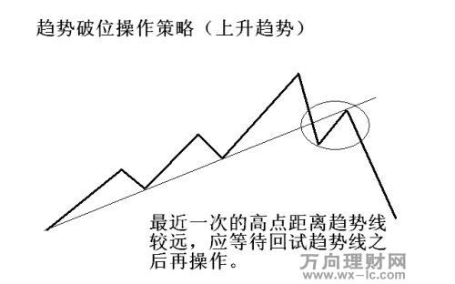

```yaml
unit_id: MAIN-SLIDE-040
source_slide: "趋势（下）/13.jpg"
audio_part: "中"
audio_time: "00:23:39–00:24:23"
alignment_confidence: "明确"
knowledge_path: "主课“结构和趋势” → 第二部分“趋势” → 2.3 破位与突破后的操作策略 → 当前知识点“上升趋势：最近高点距线远，可等反抽”"
```

**讲解语义：** 老师说明，若最近高点距离上升趋势线较远，跌到趋势线前已经消耗较多能量；即使破位也可能反抽，因此可等待价格回试趋势线后再卖。

**视觉语义：** 高点远离趋势线，破位后折线反弹回测，圆圈标出更稳妥的操作区。

**课程知识定位：** 主课“结构和趋势” → 第二部分“趋势” → 2.3 破位与突破后的操作策略 → 当前知识点“上升趋势：最近高点距线远，可等反抽”。这是趋势知识转化为交易行动的部分；最近高低点距趋势线近则立即执行，距离远则考虑反抽或回踩。

**检索标题：** 结构和趋势；趋势（下）；上升趋势：最近高点距线远，可等反抽；13.jpg

<!-- pagebreak -->

## MAIN-SLIDE-041｜下降趋势：最近低点距线远，可等回踩

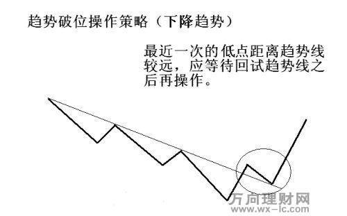

```yaml
unit_id: MAIN-SLIDE-041
source_slide: "趋势（下）/14.jpg"
audio_part: "中"
audio_time: "00:24:23–00:25:07"
alignment_confidence: "明确"
knowledge_path: "主课“结构和趋势” → 第二部分“趋势” → 2.3 破位与突破后的操作策略 → 当前知识点“下降趋势：最近低点距线远，可等回踩”"
```

**讲解语义：** 老师反向说明，若最近低点离下降趋势线很远，向上突破前已上涨较多，突破当天追入容易买在短期高位；可等待回踩趋势线后再买。

**视觉语义：** 价格从远离趋势线的低点上升并突破，随后回踩圆圈区域。

**课程知识定位：** 主课“结构和趋势” → 第二部分“趋势” → 2.3 破位与突破后的操作策略 → 当前知识点“下降趋势：最近低点距线远，可等回踩”。这是趋势知识转化为交易行动的部分；最近高低点距趋势线近则立即执行，距离远则考虑反抽或回踩。

**检索标题：** 结构和趋势；趋势（下）；下降趋势：最近低点距线远，可等回踩；14.jpg

<!-- pagebreak -->

## MAIN-SLIDE-042｜远距离突破后等待回踩的实例

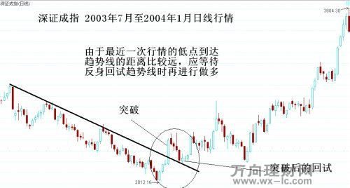

```yaml
unit_id: MAIN-SLIDE-042
source_slide: "趋势（下）/15.jpg"
audio_part: "中"
audio_time: "00:25:07–00:25:54"
alignment_confidence: "明确"
knowledge_path: "主课“结构和趋势” → 第二部分“趋势” → 2.3 破位与突破后的操作策略 → 当前知识点“远距离突破后等待回踩的实例”"
```

**讲解语义：** 老师用深证成指历史行情说明，低点离下降趋势线较远，突破后立即买入会遭遇连续回调；等待回踩趋势线可获得更稳妥的入场位置。

**视觉语义：** 下降趋势线、突破点和回试区域均在图中标注。

**课程知识定位：** 主课“结构和趋势” → 第二部分“趋势” → 2.3 破位与突破后的操作策略 → 当前知识点“远距离突破后等待回踩的实例”。这是趋势知识转化为交易行动的部分；最近高低点距趋势线近则立即执行，距离远则考虑反抽或回踩。

**检索标题：** 结构和趋势；趋势（下）；远距离突破后等待回踩的实例；15.jpg

<!-- pagebreak -->

## MAIN-SLIDE-043｜当时上证日线趋势线的应用

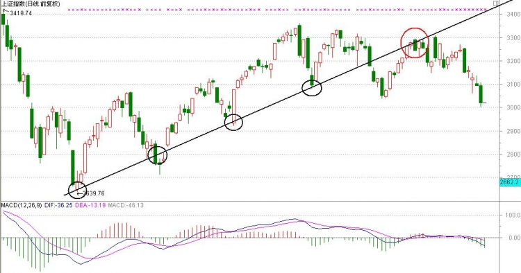

```yaml
unit_id: MAIN-SLIDE-043
source_slide: "趋势（下）/16.jpg"
audio_part: "中"
audio_time: "00:25:54–约00:29:39"
alignment_confidence: "明确"
knowledge_path: "主课“结构和趋势” → 第二部分“趋势” → 2.3 破位与突破后的操作策略 → 当前知识点“当时上证日线趋势线的应用”"
```

**讲解语义：** 老师以上证指数日线说明，多低点连成的趋势线已经被跌破，但由于前一高点离线较远，若在首次破位处卖出可能接近阶段低位，更合理的计划是等待反抽趋势线再处理。

**视觉语义：** 多个圆圈标出趋势线触点，右侧K线跌破后继续走弱。

**课程知识定位：** 主课“结构和趋势” → 第二部分“趋势” → 2.3 破位与突破后的操作策略 → 当前知识点“当时上证日线趋势线的应用”。这是趋势知识转化为交易行动的部分；最近高低点距趋势线近则立即执行，距离远则考虑反抽或回踩。

**检索标题：** 结构和趋势；趋势（下）；当时上证日线趋势线的应用；16.jpg

